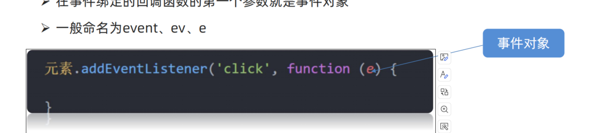
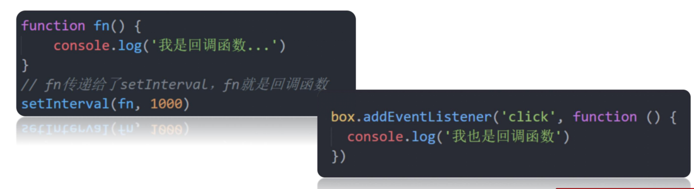
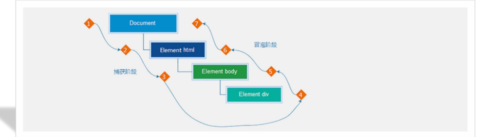
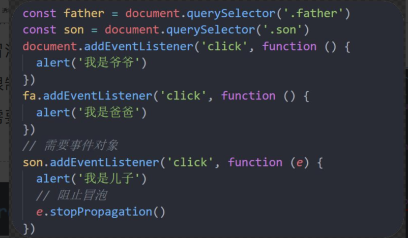
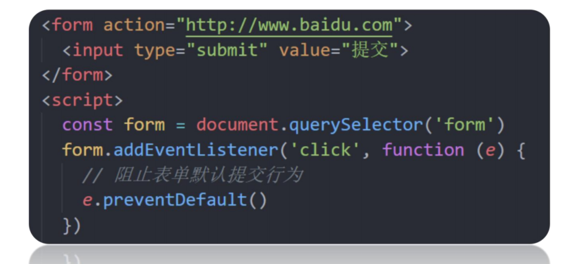
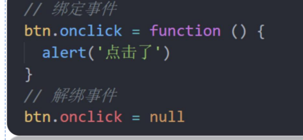
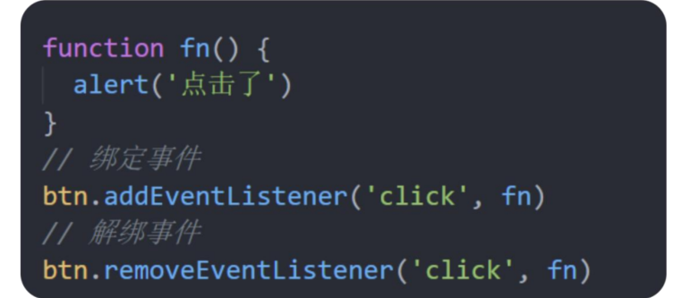
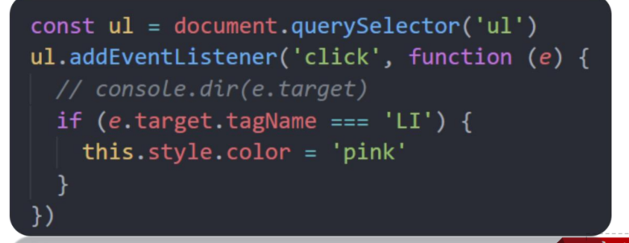
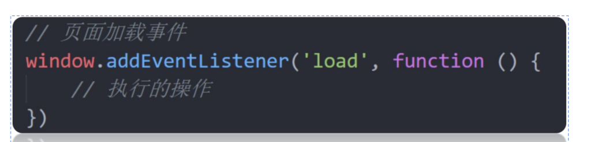
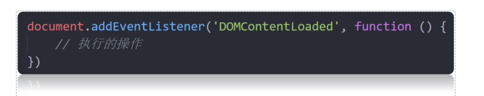

事件监听
----

什么是事件？

事件是在编程时系统内发生的动作或者发生的事情

比如用户在网页上单击一个按钮

l什么是事件监听？

就是让程序检测是否有事件产生，一旦有事件触发，就立即调用一个函数做出响应，也称为 绑定事件或者注册事件比如鼠标经过显示下拉菜单，比如点击可以播放轮播图等等

事件监听语法：

```javascript
元素对象。addEventListener（'事件类型'，要执行的函数）
```

事件监听三要素：

事件源： 那个dom元素被事件触发了，要获取dom元素

事件类型： 用什么方式触发，比如鼠标单击 click、鼠标经过 mouseover 等

事件调用的函数： 要做什么事

事件监听的版本

DOM L0

事件源.on事件 = function() { }

DOM L2

事件源.addEventListener(事件， 事件处理函数)

区别：

on方式会被覆盖，addEventListener方式可绑定多次，拥有事件更多特性，推荐使用

事件类型
----

1.鼠标事件（click点击鼠标（mouseenter鼠标经过）（mouseleave鼠标离开）

2.焦点事件（focus获得焦点）（blur失去焦点）

3.键盘事件（Keydown键盘按下）（keyup键盘抬起）

4.文本事件（input表单输入）

事件对象
----

事件对象是什么

也是个对象，这个对象里有事件触发时的相关信息

例如：鼠标点击事件中，事件对象就存了鼠标点在哪个位置等信息



1.事件对象是什么？

也是个对象，这个对象里有事件触发时的相关信息

2\. 事件对象在哪里？

在事件绑定的回调函数的第一个参数就是事件对象

环境对象
----

环境对象：指的是函数内部特殊的变量 this ，它代表着当前函数运行时所处的环境

作用：弄清楚this的指向，可以让我们代码更简洁

函数的调用方式不同，this 指代的对象也不同

【谁调用， this 就是谁】 是判断 this 指向的粗略规则

直接调用函数，其实相当于是 window.函数，所以 this 指代 window

1\. 环境对象this是什么？

它代表着当前函数运行时所处的环境

2\. 判断 this 指向的粗略规则是什么？

【谁调用， this 就是谁】

回调函数
----

如果将函数 A 做为参数传递给函数 B 时，我们称函数 A 为回调函数

简单理解： 当一个函数当做参数来传递给另外一个函数的时候，这个函数就是回调函数



事件流
---

事件流指的是事件完整执行过程中的流动路径

说明：假设页面里有个div，当触发事件时，会经历两个阶段，分别是捕获阶段、冒泡阶段

简单来说：捕获阶段是 从父到子 冒泡阶段是从子到父

实际工作都是使用事件冒泡为主



### 事件捕捉

事件捕获概念：

从DOM的根元素开始去执行对应的事件 (从外到里)

事件捕获需要写对应代码才能看到效果

addEventListener第三个参数传入 true 代表是捕获阶段触发（很少使用）

若传入false代表冒泡阶段触发，默认就是false

若是用 L0 事件监听，则只有冒泡阶段，没有捕获

### 事件冒泡

事件冒泡概念:

当一个元素的事件被触发时，同样的事件将会在该元素的所有祖先元素中依次被触发。这一过程被称为事件冒泡

简单理解：当一个元素触发事件后，会依次向上调用所有父级元素的 同名事件

事件冒泡是默认存在的

L2事件监听第三个参数是 false，或者默认都是冒泡

### 阻止冒泡

事件对象.stopPropagation()

问题：因为默认就有冒泡模式的存在，所以容易导致事件影响到父级元素

需求：若想把事件就限制在当前元素内，就需要阻止事件冒泡

前提：阻止事件冒泡需要拿到事件对象

注意：此方法可以阻断事件流动传播，不光在冒泡阶段有效，捕获阶段也有效



#### 阻止默认行为的发生

比如阻止链接跳转，表单域跳转

e.preventDefault()



解绑事件
----

on事件方式，直接使用null覆盖偶就可以实现事件的解绑

语法：



addEventListener方式，必须使用：

removeEventListener(事件类型,事件处理函数,\[获取捕获或者冒泡阶段\])



注意：匿名函数无法被解绑

鼠标经过事件的区别

mouseover和mouseout会有冒泡效果

mouseenter和mouseleave没有冒泡效果(推荐)

两种注册事件的区别

### 传统on注册（LO）

同一个对象,后面注册的事件会覆盖前面注册(同一个事件)

直接使用null覆盖偶就可以实现事件的解绑

都是冒泡阶段执行的

### 事件监听注册（L2）

语法:addEventListener(事件类型,事件处理函数,是否使用捕获)

后面注册的事件不会覆盖前面注册的事件(同一个事件)

可以通过第三个参数去确定是在冒泡或者捕获阶段执行

必须使用removeEventListener(事件类型,事件处理函数,获取捕获或者冒泡阶段)

匿名函数无法被解绑

事件委托
----

事件委托

优点：减少注册次数，可以提高程序性能

原理：利用事件冒泡的特点

给父元素注册事件，当我们触发了子元素的时候，会冒泡到父元素身上，从而触发父元素的事件

找到真正的触发元素：

事件对象.target.tagName



其他事件：
-----

页面加载事件

页面加载事件有哪两个？如何添加？

load事件 监听整个页面资源给window加

DOMContentLoaded

给document加

无需等待样式表、图像等完全加载



注意：不光可以监听整个页面资源加载完毕，也可以针对某个资源绑定load事件

当初始的HTML文档被完全加载和解析完成之后，DOMContentLoaded事件被触发，而无需等待样式表、图像等完

全加载

l事件名：DOMContentLoaded

l监听页面DOM加载完毕：

给document添加DOMContentLoaded事件

