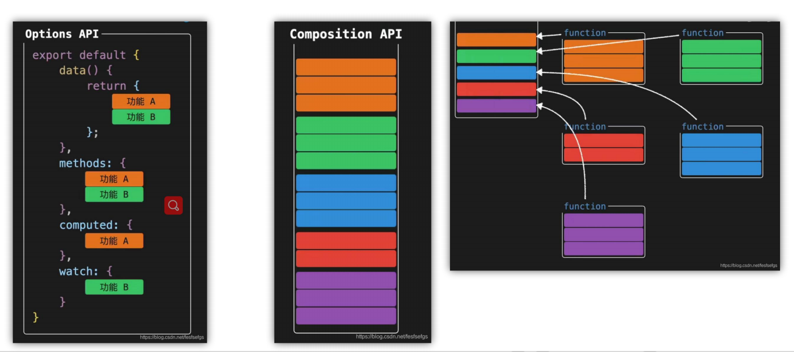

Vue3的设计思想：对比Vue2和Vue3的设计差异

1.更容易维护：Vue3 组合式API，更好的Typescript支持

2.更快的速度：重写diffsuanfa，模版编译优化，更高的组件初始化

3.更小的体积：良好的TreeShanking，按需引入

4.更有的数据响应式 :  proxy



Vue2 采用**选项式 API** 组织代码，将组件逻辑拆分为 `data`、`methods`、`computed`、`watch` 等选项。这种方式对新手友好，入门门槛低，但在大型组件中，相关逻辑会分散在不同选项中，导致代码可读性和维护性下降

```javascript
<template>
  <div>
    <h1>{{ count }}</h1>
    <button @click="increment">点击加1</button>
    <p>双倍值：{{ doubleCount }}</p>
  </div>
</template>

<script>
export default {
  // 数据定义
  data() {
    return {
      count: 0
    };
  },
  // 计算属性
  computed: {
    doubleCount() {
      return this.count * 2;
    }
  },
  // 方法
  methods: {
    increment() {
      this.count++;
    }
  },
  // 生命周期
  mounted() {
    console.log("组件挂载完成");
  }
};
</script>
```

Vue3 推出**组合式 API**（核心是 `setup` 函数），允许开发者按**逻辑功能**而非选项类型组织代码。相关逻辑可以封装成独立的组合函数（Composables），大幅提升代码复用性和可维护性，尤其适合大型项目。

```javascript
<template>
  <div>
    <h1>{{ count }}</h1>
    <button @click="increment">点击加1</button>
    <p>双倍值：{{ doubleCount }}</p>
  </div>
</template>

<script setup>
import { ref, computed, onMounted } from 'vue';

// 响应式数据
const count = ref(0);

// 计算属性
const doubleCount = computed(() => count.value * 2);

// 方法
const increment = () => {
  count.value++;
};

// 生命周期
onMounted(() => {
  console.log("组件挂载完成");
});
</script>
```

**Vue2 响应式缺陷示例**：

```javascript
// Vue2 中无法监听的场景
const vm = new Vue({
  data() {
    return {
      user: { name: "张三" },
      list: [1, 2, 3]
    };
  }
});

// 1. 对象新增属性无响应
vm.user.age = 20; // 视图不更新
// 需手动调用 Vue.set
Vue.set(vm.user, "age", 20);

// 2. 数组下标修改无响应
vm.list[0] = 100; // 视图不更新
// 需调用数组变异方法
vm.list.splice(0, 1, 100);
```

**Vue3 响应式优势示例**：

```javascript
import { reactive } from 'vue';

const state = reactive({
  user: { name: "张三" },
  list: [1, 2, 3]
});

// 1. 对象新增属性自动响应
state.user.age = 20; // 视图自动更新

// 2. 数组下标修改自动响应
state.list[0] = 100; // 视图自动更新

// 3. 支持 Set 类型响应式
const setData = reactive(new Set([1, 2, 3]));
setData.add(4); // 视图自动更新
```

组件通信：

Vue3 兼容 Vue2 的通信方式（Props、、parent/$children），但新增了更灵活的方案：

*   **provide/inject 增强**：Vue3 中 `provide/inject` 支持响应式数据传递；
*   **v-model 重构**：Vue2 中一个组件只能有一个 `v-model`，Vue3 支持多个 `v-model` 绑定不同属性。
*   ```javascript
    <!-- 子组件 -->
    <template>
      <input :value="username" @input="$emit('update:username', $event.target.value)" />
      <input :value="password" @input="$emit('update:password', $event.target.value)" />
    </template>
    <script setup>
    defineProps(['username', 'password']);
    defineEmits(['update:username', 'update:password']);
    </script>
    
    <!-- 父组件 -->
    <template>
      <LoginForm 
        v-model:username="userName" 
        v-model:password="passWord" 
      />
    </template>
    <script setup>
    import { ref } from 'vue';
    import LoginForm from './LoginForm.vue';
    const userName = ref('');
    const passWord = ref('');
    </script>
    ```
    
    ### 兼容性与迁移策略
    

#### 核心联系：向下兼容

*   Vue3 并非完全推翻 Vue2，而是在保留核心设计（如模板语法、组件化、指令系统）的基础上优化：
    
*   模板语法完全兼容（`v-if`、`v-for`、`v-bind` 等指令用法不变）；
*   选项式 API 依然可用，Vue2 项目可渐进式迁移到 Vue3；
*   **废弃 API**：Vue3 移除了 `Vue.filter`、`$on/$off`（事件总线）、`$children` 等 API；
*   **构建工具**：Vue3 推荐使用 Vite 替代 Webpack，开发环境启动速度提升 10 倍以上；
*   **TypeScript 支持**：Vue3 原生支持 TS，组合式 API 比选项式 API 更易适配 TS 类型系统。

```javascript
<!-- Vue3 中混合使用选项式 API 和组合式 API -->
<script>
import { ref } from 'vue';
export default {
  data() {
    return {
      msg: "Vue2 选项式 API"
    };
  },
  setup() {
    // 组合式 API
    const count = ref(0);
    return { count };
  },
  methods: {
    // 选项式 API 方法可访问 setup 中返回的属性
    increment() {
      this.count++;
    }
  }
};
</script>
```

### 总结：如何选择？

*   **小型项目 / 快速迭代**：Vue2 依然可用，学习成本低，生态成熟；
*   **大型项目 / 长期维护**：优先选择 Vue3，组合式 API 提升代码复用性，响应式系统更完善；
*   **新团队 / 新项目**：直接使用 Vue3 + Vite + Pinia 技术栈，适配未来趋势。

Vue2 与 Vue3 本质是「继承与进化」的关系：Vue3 保留了 Vue2 简洁、渐进式的核心优势，同时解决了大型项目开发中的性能和可维护性问题。对于开发者而言，无需完全抛弃 Vue2 知识，只需重点掌握组合式 API 和响应式原理的变化，即可快速完成技术升级。

#### 总结

1.  **核心 API 差异**：Vue2 采用选项式 API 按选项拆分逻辑，Vue3 组合式 API 按功能聚合逻辑，更适合大型项目；
2.  **响应式原理**：Vue2 基于 `Object.defineProperty` 存在监听盲区，Vue3 改用 `Proxy` 实现全量响应，性能和功能更优；
3.  **迁移策略**：Vue3 向下兼容选项式 API，支持渐进式迁移，新项目推荐直接使用 Vue3 + Vite 技术栈。