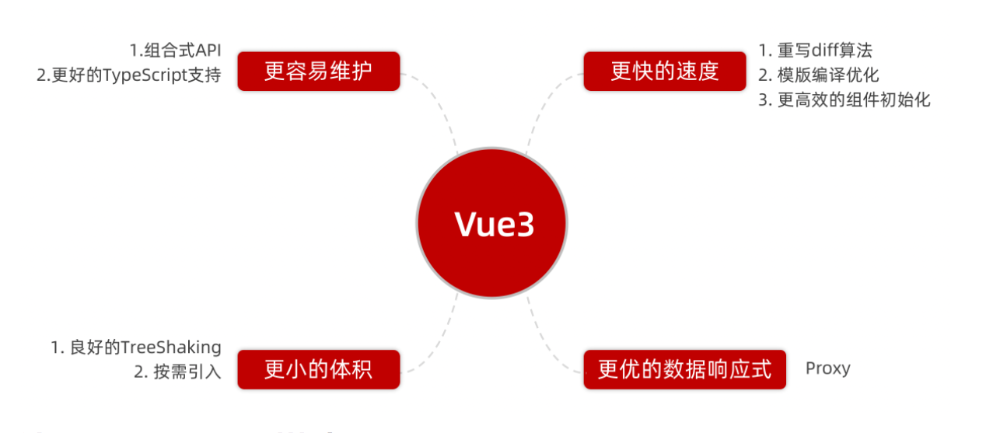
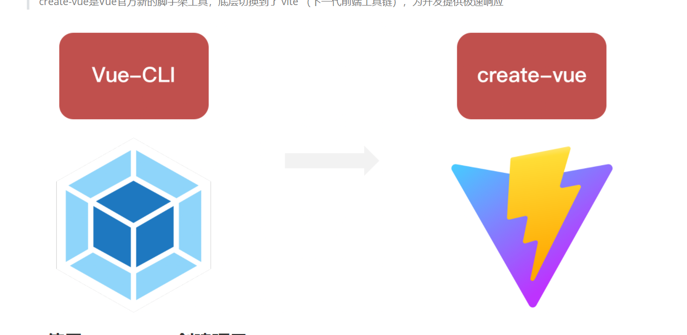
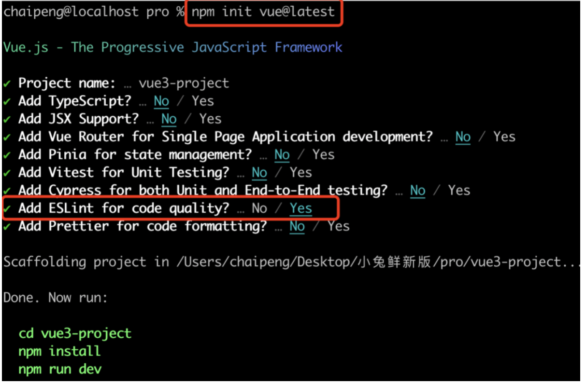
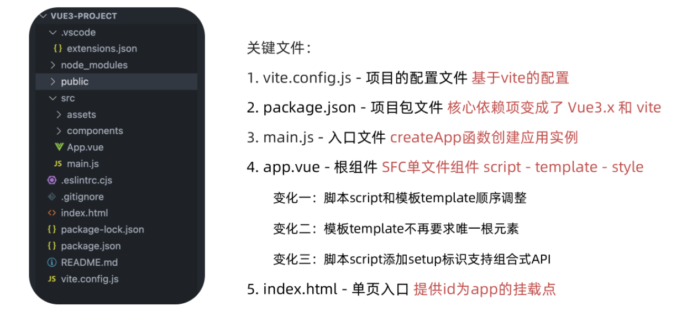
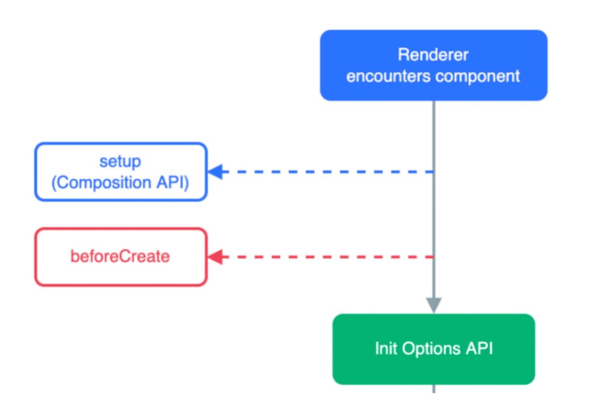
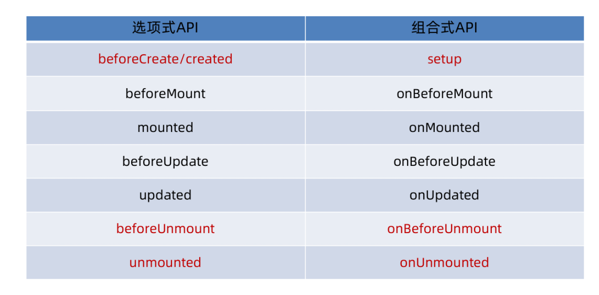
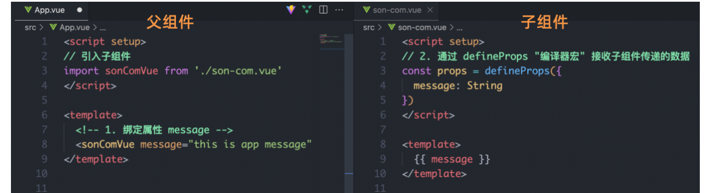
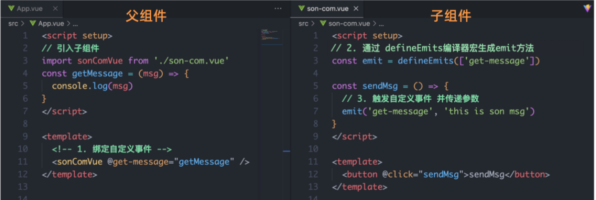

****认识Vue3****
--------------

### ****1\. Vue2 选项式 API vs Vue3 组合式API****

```javascript
<script>
export default {
  data(){
    return {
      count:0
    }
  },
  methods:{
    addCount(){
      this.count++
    }
  }
}
</script>
```

```javascript
<script setup>
import { ref } from 'vue'
const count = ref(0)
const addCount = ()=> count.value++
</script>
```

特点：

1.  代码量变少
2.  分散式维护变成集中式维护

### ****2\. Vue3的优势****



****使用create-vue搭建Vue3项目****
----------------------------

### ****1\. 认识create-vue****

create-vue是Vue官方新的脚手架工具，底层切换到了 vite （下一代前端工具链），为开发提供极速响应



### ****2\. 使用create-vue创建项目****

前置条件 - 已安装16.0或更高版本的Node.js

执行如下命令，这一指令将会安装并执行 create-vue

npm init vue@latest



****熟悉项目和关键文件****
-----------------



****组合式API - setup选项****
------------------------

### ****1\. setup选项的写法和执行时机****

写法

```javascript
<script>
  export default {
    setup(){
      
    },
    beforeCreate(){
      
    }
  }
</script>
```

执行时机

在beforeCreate钩子之前执行



### ****2\. setup中写代码的特点****

在setup函数中写的数据和方法需要在末尾以对象的方式return，才能给模版使用

```javascript
<script>
  export default {
    setup(){
      
    },
    beforeCreate(){
      
    }
  }
</script>
```

****组合式API - watch****
----------------------

侦听一个或者多个数据的变化，数据变化时执行回调函数，俩个额外参数 immediate控制立刻执行，deep开启深度侦听

### ****1\. 侦听单个数据****

```javascript
<script setup>
  // 1. 导入watch
  import { ref, watch } from 'vue'
  const count = ref(0)
  // 2. 调用watch 侦听变化
  watch(count, (newValue, oldValue)=>{
    console.log(`count发生了变化，老值为${oldValue},新值为${newValue}`)
  })
</script>
```

### ****2\. 侦听多个数据****

```javascript
<script setup>
  // 1. 导入watch
  import { ref, watch } from 'vue'
  const count = ref(0)
  const name = ref('cp')
  // 2. 调用watch 侦听变化
  watch([count, name], ([newCount, newName],[oldCount,oldName])=>{
    console.log(`count或者name变化了，[newCount, newName],[oldCount,oldName])
  })
</script>
```

### ****3\. immediate****

```javascript
<script setup>
  // 1. 导入watch
  import { ref, watch } from 'vue'
  const count = ref(0)
  // 2. 调用watch 侦听变化
  watch(count, (newValue, oldValue)=>{
    console.log(`count发生了变化，老值为${oldValue},新值为${newValue}`)
  },{
    immediate: true
  })
</script>
```

### ****4\. deep****

通过watch监听的ref对象默认是浅层侦听的，直接修改嵌套的对象属性不会触发回调执行，需要开启deep

```javascript
<script setup>
  // 1. 导入watch
  import { ref, watch } from 'vue'
  const state = ref({ count: 0 })
  // 2. 监听对象state
  watch(state, ()=>{
    console.log('数据变化了')
  })
  const changeStateByCount = ()=>{
    // 直接修改不会引发回调执行
    state.value.count++
  }
</script>
​
<script setup>
  // 1. 导入watch
  import { ref, watch } from 'vue'
  const state = ref({ count: 0 })
  // 2. 监听对象state 并开启deep
  watch(state, ()=>{
    console.log('数据变化了')
  },{deep:true})
  const changeStateByCount = ()=>{
    // 此时修改可以触发回调
    state.value.count++
  }
</script>
​
```

****组合式API - 生命周期函数****
-----------------------

### ****1\. 选项式对比组合式****



### ****2\. 生命周期函数基本使用****

导入生命周期函数

执行生命周期函数，传入回调

<scirpt setup> import { onMounted } from 'vue' onMounted(()=>{ // 自定义逻辑 }) </script>

### ****3\. 执行多次****

生命周期函数执行多次的时候，会按照顺序依次执行

<scirpt setup> import { onMounted } from 'vue' onMounted(()=>{ // 自定义逻辑 }) ​ onMounted(()=>{ // 自定义逻辑 }) </script>

****组合式API - 父子通信****
---------------------

### ****1\. 父传子****

基本思想

父组件中给子组件绑定属性

子组件内部通过props选项接收数据



### ****2\. 子传父****

基本思想

父组件中给子组件标签通过@绑定事件

子组件内部通过 emit 方法触发事件

