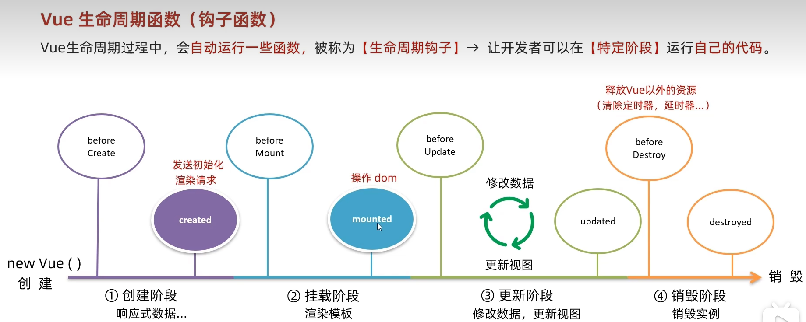
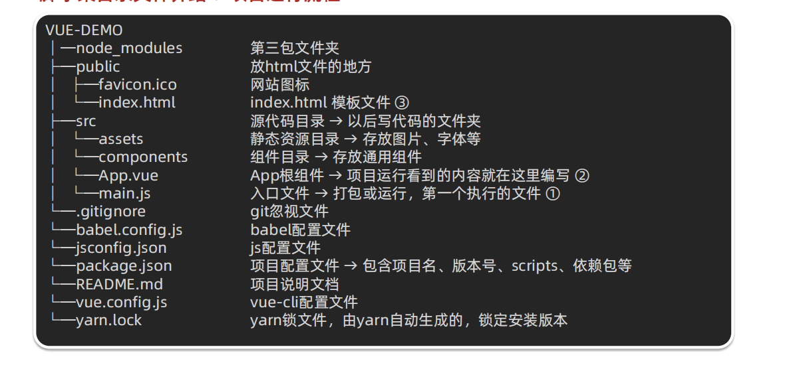
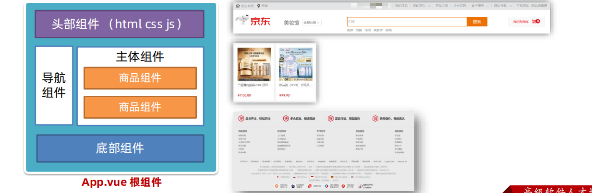
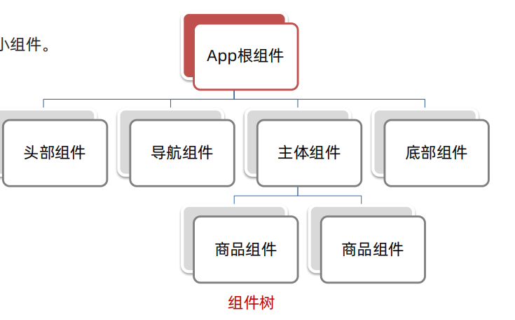
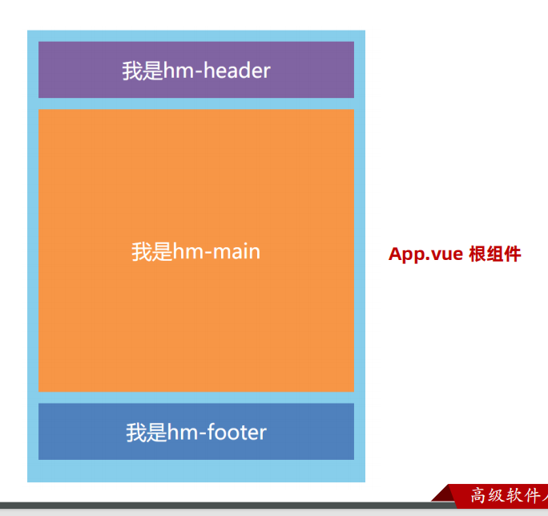

vue生命周期：

**一个Vue实例从创建到销毁的整个过程**

生命周期的四个阶段：

**1创建，2挂载，3更新，4 销毁**

**创建阶段**：new Vue 创建响应式数据

**挂载阶段**：渲染模版

**更新阶段:**修改数据，更新视图

创建和挂载只执行一次，更新多次执行

**销毁阶段**：销毁实例

什么时候可以发送初始化渲染请求，（**创建的最后**）

什么时候操作DOM（**挂载的最后**）

Vue生命周期函数（**钩子函数**）

八个钩子分别是：

创建阶段before Create created

挂载阶段：before Mount mounted

更新阶段：before Update updated

销毁阶段:before Destroy destroyed

工程化开发&脚手架

开发Vue两种方式：核心包传统开发模式，工程化开发模式

VueCLI 是Vue官方提供的一个全局命令工具，可以帮助我们快速创建一个开发Vue项目的标准化基础架子

好处：开行即用，零配置，内置Babel等工具，标准化

使用步骤：

1.  全局安装 (一次) ：yarn global add @vue/cli 或 npm i @vue/cli -g
2.  查看 Vue 版本：vue --version
3.  创建项目架子：vue create project-name（项目名-不能用中文）
4.  启动项目： yarn serve 或 npm run serve（找package.json）

组件化开发&根组件

组件化：一个页面可以拆分成一个个组件，每个组件有着自己独立的结构，样式，行为

好处：便于维护，利于复用，提升开发效率

组件分类：普通组件，根组件

根组件：整个应用最上层的组件，包裹所有普通小组件

App。vue文件的三个组成部分：

template：结构 ，script：js逻辑，style：样式

style标签，lang=“less“开启less功能

**(1) 组件化：**

页面可拆分成一个个组件，每个组件有着独立的结构、样式、行为

① 好处：便于维护，利于复用 → 提升开发效率。

② 组件分类：普通组件、根组件。

**(2) 根组件：**

整个应用最上层的组件，包裹所有普通小组件。

一个根组件App.vue，包含的三个部分：

① template 结构 (只能有一个根节点)

② style 样式 (可以支持less，需要装包 less 和 less-loader )

③ script 行为

普通组件的注册方式：

1：局部注册：只能在注册的组件内使用

（1）创建Vue文件（三个组成部分）

（2）在使用的组件内都能使用

全局注册：所有组件内都使用

① 创建 .vue 文件 (三个组成部分)

② main.js 中进行全局注册

使用：

◆ 当成 html 标签使用 <组件名>

注意:

◆ 组件名规范 → 大驼峰命名法，如：HmHeader

技巧：

◆ 一般都用局部注册，如果发现确实是通用组件，再定义到全局。

总结：

普通组件的注册使用：

1.两种注册方式：

① 局部注册

(1) 创建.vue组件 (单文件组件)

(2) 使用的组件内导入，并局部注册 components: { 组件名：组件对象 }

② 全局注册：

(1) 创建.vue组件 (单文件组件)

(2) main.js内导入，并全局注册 Vue.component(组件名, 组件对象)

2\. 使用：

<组件名>

技巧：

一般都用局部注册，如果发现确实是通用组件，再抽离到全局。