### 1.组件的三大组成部分：

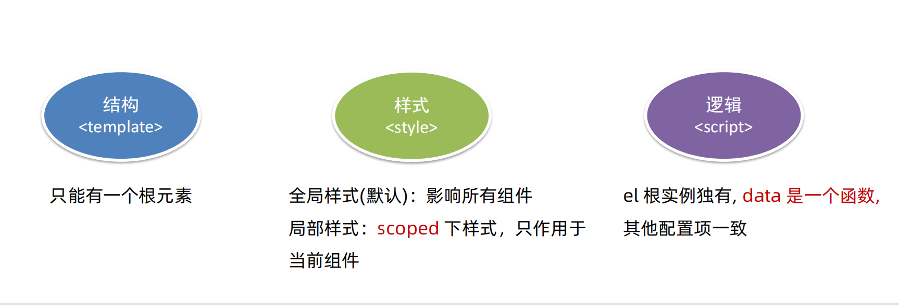

#### 组件的样式冲突：

默认情况：写在组件中的样式会“全局生效”-->因此很容易造成对个组件之间的样式冲突

1.全局样式：默认组件中的样式会作用到全局

2.局部样式：可以给组件加上scoped属性，可以让样式只作用于当前组件

#### scoped原理：

1.当前组件内标签都被添加data-v-hash值的属性

2.css选择器都被添加【data-v-hash值】的属性选择器

最终效果：必须是当前组件的元素：才会有自定义属性，才会被这个样式作用到

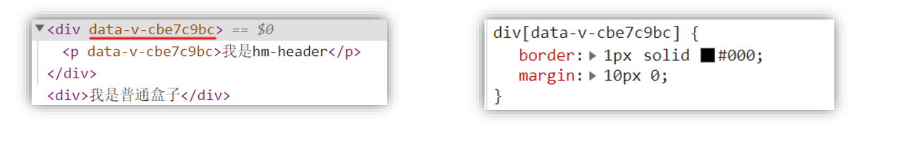

#### data 是一个函数

一个组件的data选择必须是一个函数。保证每个组件实例，维护独立的一份数据对象。

每次创建新的组件实例，都会执行一次data函数，得到一个新的对象

小结：

组件的三大组成部分得注意点：

1.结构：有且只有一个根元素

2.样式：默认全局样式，加上scoped局部样式

3.逻辑：data是一个函数，保证数据独立。

### 2.组件通信：

什么是组件通信：是指组件与组件之间的数据传递。

组件的数据是独立的。无法直接访问其他组件数据

用其他组件的数据-->组件通信

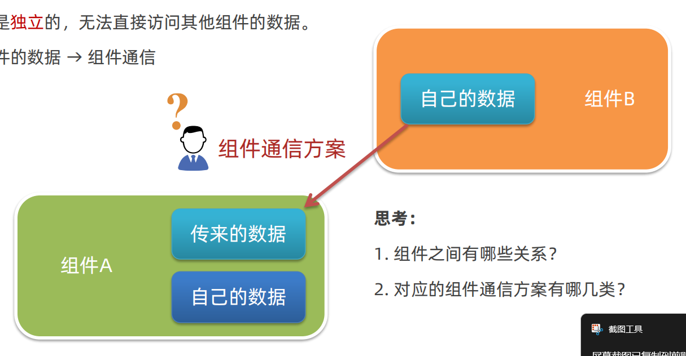

### 3.不同组件关系和组件通信方案分类

#### 组件关系分类：父子关系，非父子关系

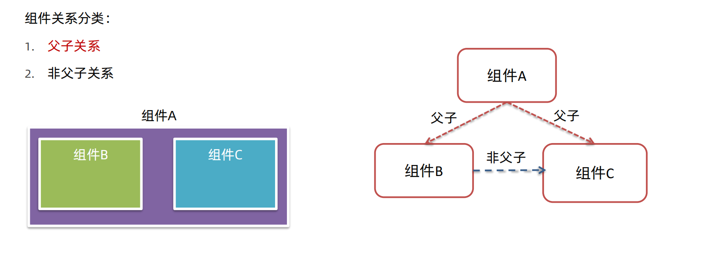

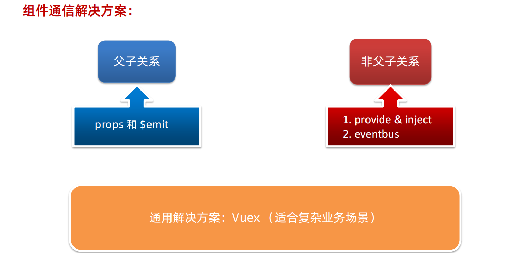

#### 父子通信：

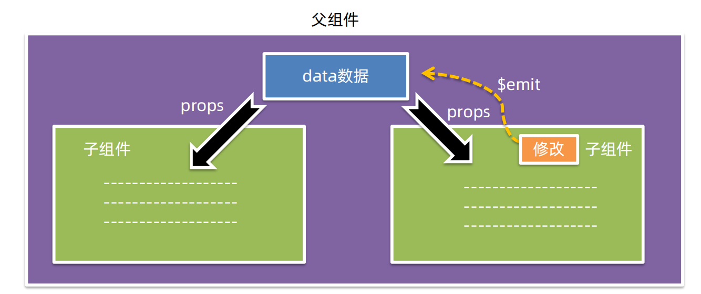

1.父组件通过props将数据传递给子组件：

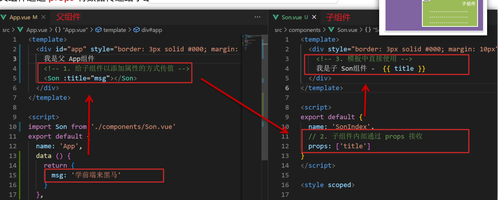

2.子组件利用$emit通知组件修改更新：

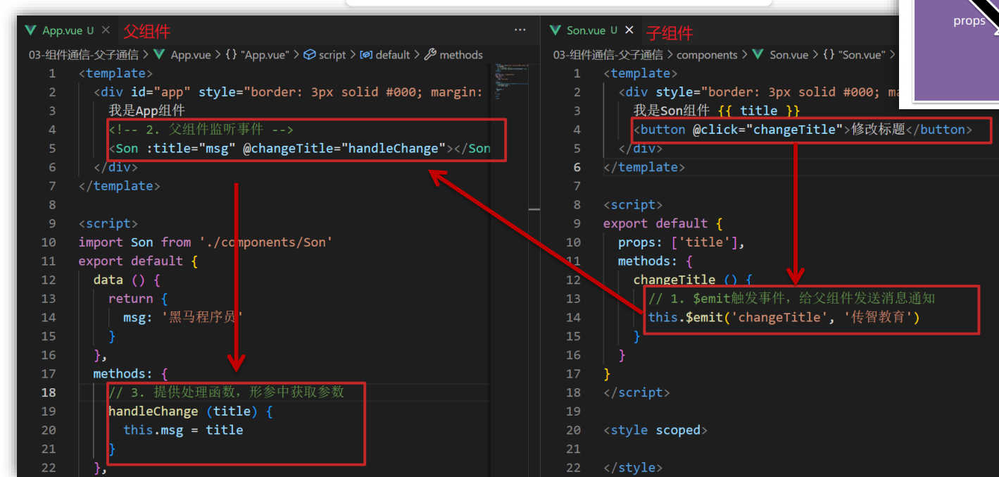

小结：

两种组件关系分类 和 对应的组件通信方案

父子关系 → props & $emit

非父子关系 → provide & inject 或 eventbus

通用方案 → vuex

2\. 父子通信方案的核心流程

2.1 父传子props：

① 父中给子添加属性传值 ② 子props 接收 ③ 子组件使用

2.2 子传父$emit：

① 子$emit 发送消息 ②父中给子添加消息监听 ③ 父中实现处理函数

### 4.什么是Prop

#### prop定义：

组件上注册的一些自定义属性

prop作用：向子组件传递数据

特点：可以传递任意数量的prop，可以传递任意类型的prop

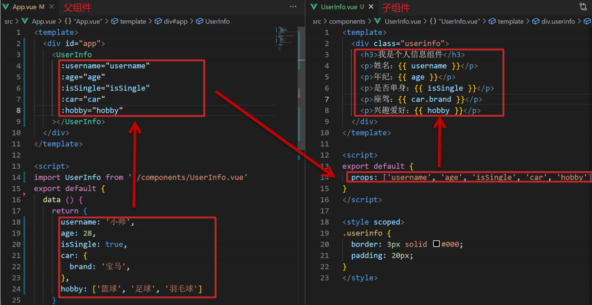

props校验

为组件的prop指定验证要求，不符合要求，控制台就会有错误提示-->帮助开发者，快速发现错误，

语法：1.类型校验，2.非空校验3.默认值4.自定义校验

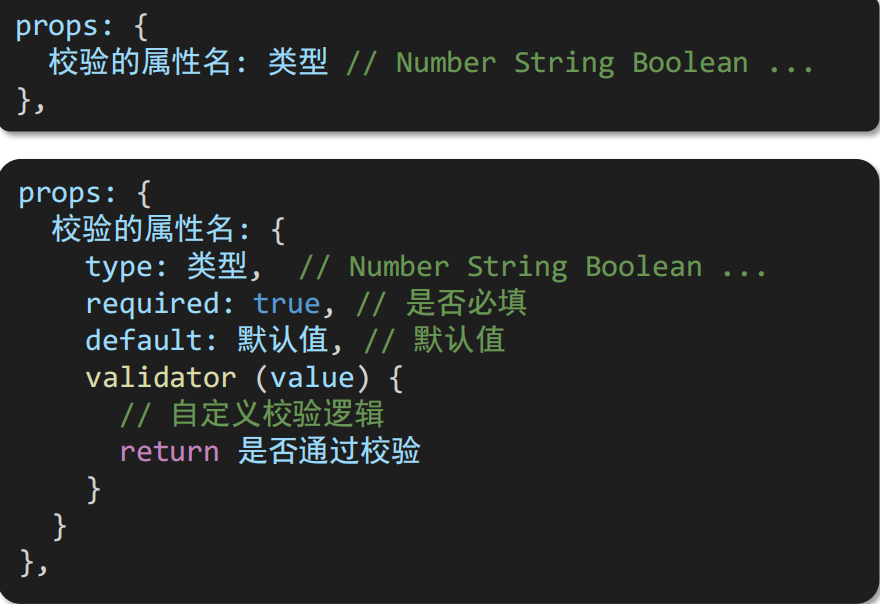

### 5.prop &data 单向数据流。

共同点：都可以给组件提供数据

区别：

data的数据是自己的，-->随便改

prop的数据是外部的-->不能直接改，要遵循单向数据流

单向数据流：父级prop的数据更新，会向下流动，影响子组件，这个数据流动是单向的。

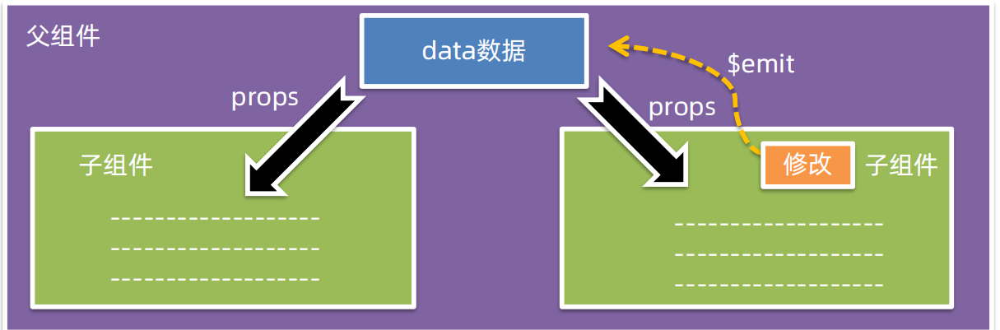

谁的数据谁负责

### 6.非父子通信：

非父子组件之间，进行简易消息传递（复杂场景用vuex）

1，创建一个都能访问到的事件总线（空Vue实例）-->utile/Event Bus.js

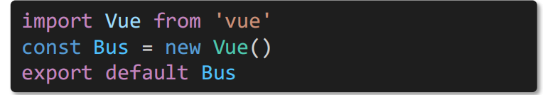

2、A组件（接收方），监听Bus实例的事件

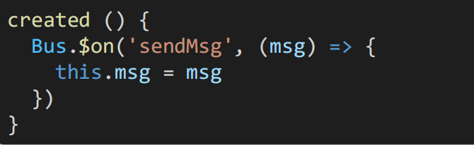

3、B组件（发送方）触发Bus实例的事件

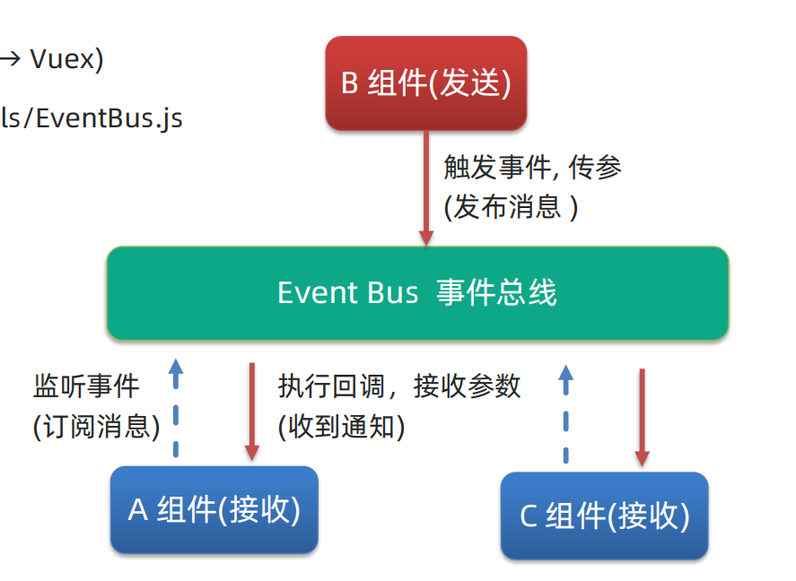

非父子通信 provide&inject

作用：跨层级共享数据。

1.父组件provide提供数据

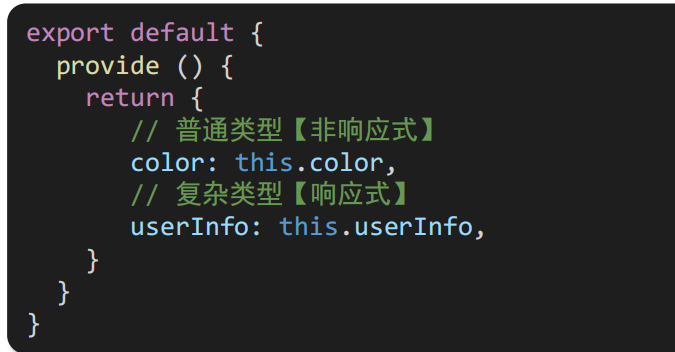

2.子孙组件inject取值使用

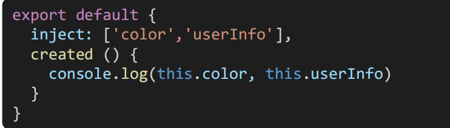

### 7.V-model原理

原理：v-model本质是一个语法糖。例如应用在输入框就是value属性和input事件和写

作用提供数据的双向绑定

1：数据变，视图跟着变： :value

2：视图变，数据跟着变: @input

注意：$event 用于在模版中，获取事件的形参

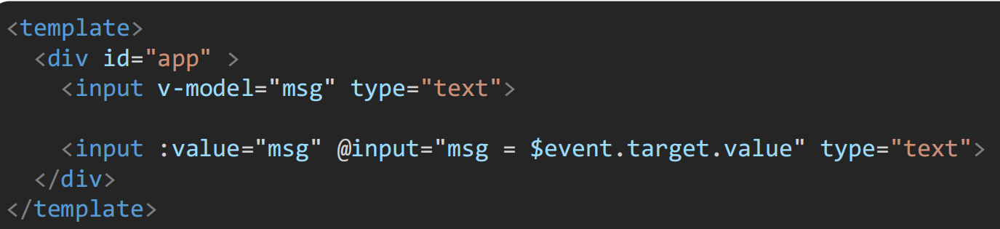

.sync 修饰符，

作用：可以实现子组件与父组件数据的双向绑定，简化代码

特点：prop属性名，可以自定义，非固定为value

场景：封装弹框类的基础组件，visible属性 true显示 false隐藏

本质：就是：属性名和@update：属性名和写

ref &refs

作用：利用ref和$refs可以用于获取Dom元素或组件实例

特点：查找范围——>当前组件内

.获取Dom：

1.目标标签-添加ref属性

2.恰当实际，通过this.$refs.xx 获取目标标签

获取组件：

1，目标组件-添加ref属性

2.恰当实际，通过this.$refs.XXX获取目标组件

Vue 异步更新、$nextTick

需求：编辑标题，编辑框自动聚焦

1.点击编辑，显示编辑框

2.让编辑框，立刻获取焦点

问题：‘显示之后’立刻获取焦点是不能成功的

原因：Vue是异步更新Dom（提升性能）

$nextTick:等Dom更新后，才会触发执行此方法里的函数体

语法：this.$nextTick(函数体）