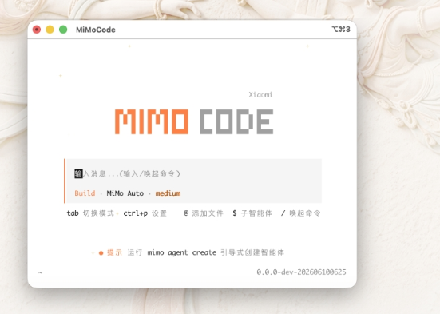
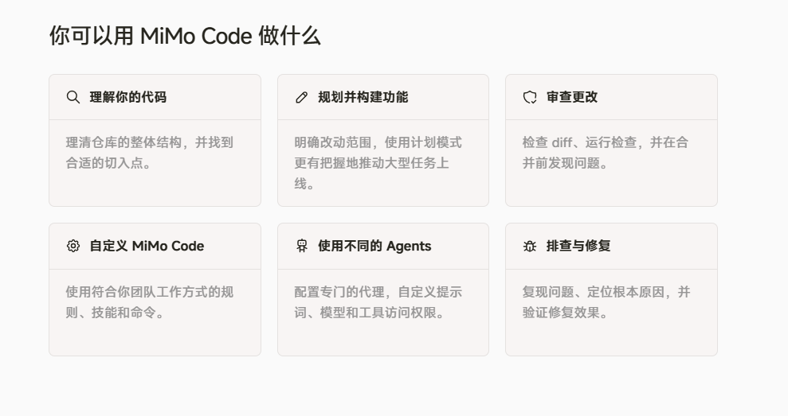
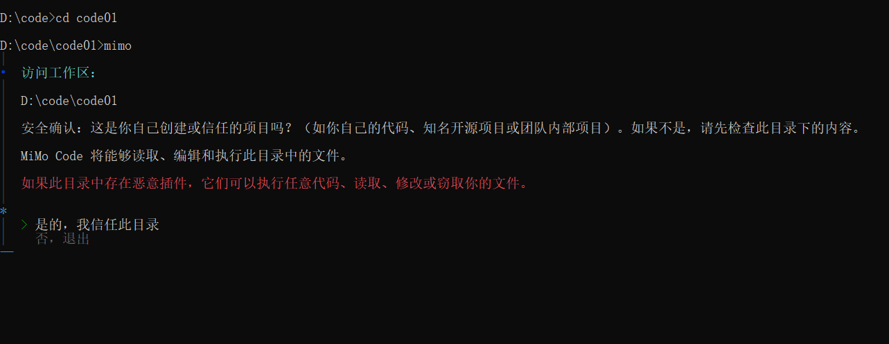
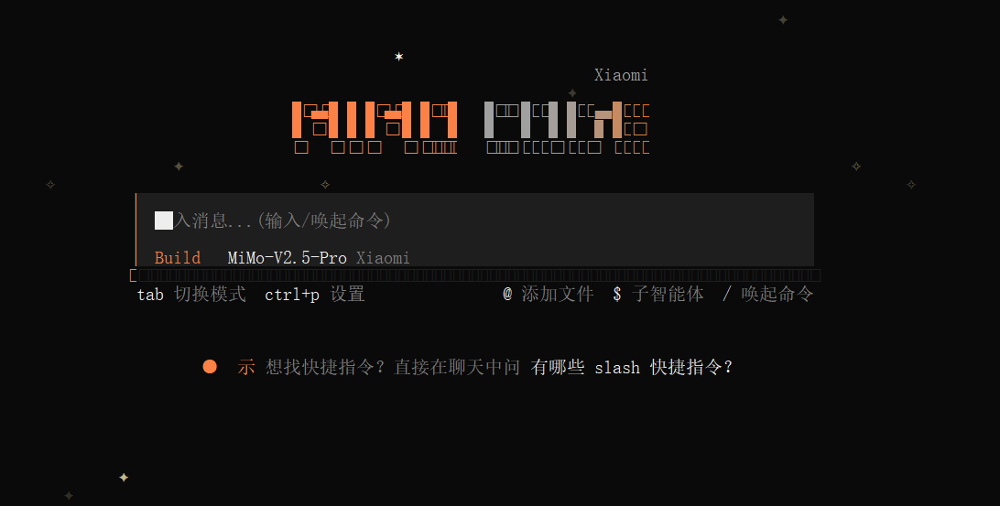
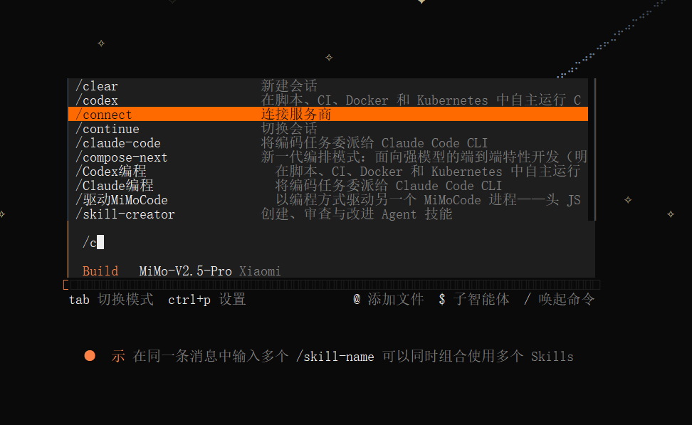
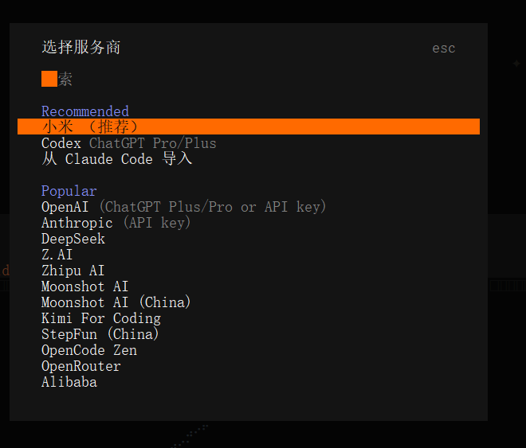

MiMo Code 是**小米 MiMo AI 团队**于**2026 年 6 月 11 日**开源发布的**终端原生 AI 编程智能体（Coding Agent）**，版本首发 V0.1.0，基于开源项目 OpenCode 二次深度开发，采用 **MIT 开源协议**，个人、企业均可免费二次开发与商用分发



### 一、MiMo Code 核心优势

1.  **零配置免费通道**：内置 MiMo Auto 匿名免费通道，无需注册、不用 API Key，2026.7.26 前无限免费使用；兼容 DeepSeek、Kimi、GLM 等 70 + 第三方大模型。
2.  **项目级持久记忆**：自动存储仓库架构、历史需求、编码规范，重启终端不会遗忘项目上下文，大型工程无失忆问题。
3.  **多 Agent 流水线开发**：一键切换 Plan/Build/Compose 模式，自动完成「需求拆解→编码→单元测试→代码评审→Git 提交」全流程。
4.  **终端全权限操作**：直接读写项目文件、运行命令、解决 Git 冲突、解析报错堆栈，不用复制粘贴代码。
5.  **开源商用自由**：MIT 协议，个人 / 企业均可二次开发、私有化部署。



二、安装与启动
-------

#### 前提条件

要在终端中使用 MiMo Code，你需要：

1.  一款现代终端模拟器，例如：
    
    *   [WezTerm](https://wezterm.org/ "WezTerm")，跨平台
    *   [Alacritty](https://alacritty.org/ "Alacritty")，跨平台
    *   [Ghostty](https://ghostty.org/ "Ghostty")，Linux 和 macOS
    *   [Kitty](https://sw.kovidgoyal.net/kitty/ "Kitty")，Linux 和 macOS
2.  你想使用的 LLM 提供商的 API 密钥。
    

#### 安装

安装 MiMo Code 最简单的方法是通过安装脚本。

Mac/Linux 用户推荐（为了更佳的用户体验，强烈推荐 Mac 用户使用 iTerm 或 VSCode Terminal）：

```
curl -fsSL https://mimo.xiaomi.com/install | bash
```

Windows 用户推荐：

```
powershell -ep Bypass -c "irm https://mimo.xiaomi.com/install.ps1 | iex"
```

安装完成后，[连接一个模型提供商](https://mimo.xiaomi.com/zh/mimocode/models-provider "连接一个模型提供商")，然后[运行你的第一个提示](https://mimo.xiaomi.com/zh/mimocode/first-prompt "运行你的第一个提示")。





#### 连接服务商

```
/connect
```





即可开始使用